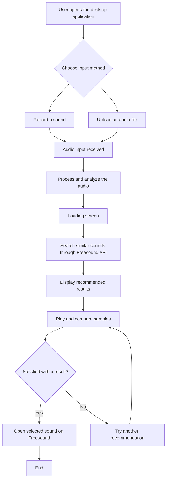

# Interface Flow

This document describes the expected user interaction for the first desktop prototype of the application.

The interface is designed to be simple, visual, and easy to use.  
The user begins by opening the application and choosing between recording a sound or uploading an existing audio file.  
After the audio is received, the system processes it, shows a loading stage, and then displays several recommended sounds retrieved from Freesound.  
The user can listen to real Freesound previews, compare results, and open the original sound page on Freesound.

## User Flow Diagram

